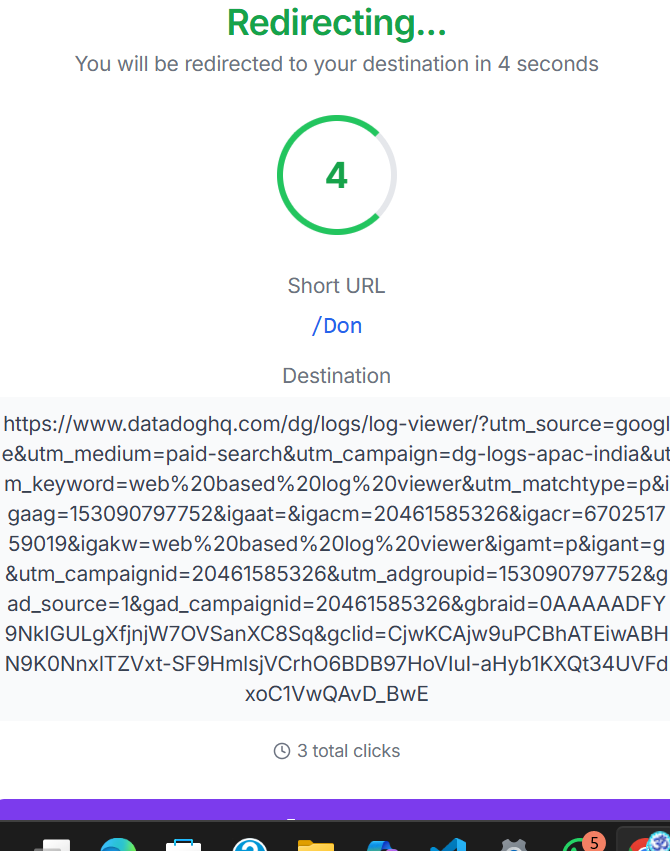

# 2203051050400
# 🔗 React URL Shortener

A simple and fast URL shortener built using **React**, **Vite**, and **localStorage**. This app allows you to shorten long URLs, track expiration, redirect using short codes, and view statistics—all without a backend.

---

## 📸 Screenshots

### 🔧 Home - URL Shortener


### 📊 Statistics Page
)

---

## 🚀 Features

- 🔗 Shorten long URLs into 6-character short codes.
- ⏰ Set custom expiration time (in minutes).
- 🧾 Optional custom short code entry.
- 📊 View all shortened URLs in the **Statistics Page**.
- 🔁 Automatic redirection when visiting `/shortcode`.
- 🧠 Logging middleware to track actions.
- 💾 Data stored in browser’s `localStorage`.

---

## 🛠 Tech Stack

- React (with Vite)
- React Router
- Material UI
- UUID
- LocalStorage

---

## 🧰 Installation

1. **Clone the Repository**

```bash
git clone https://github.com/your-username/react-url-shortener.git
cd react-url-shortener
